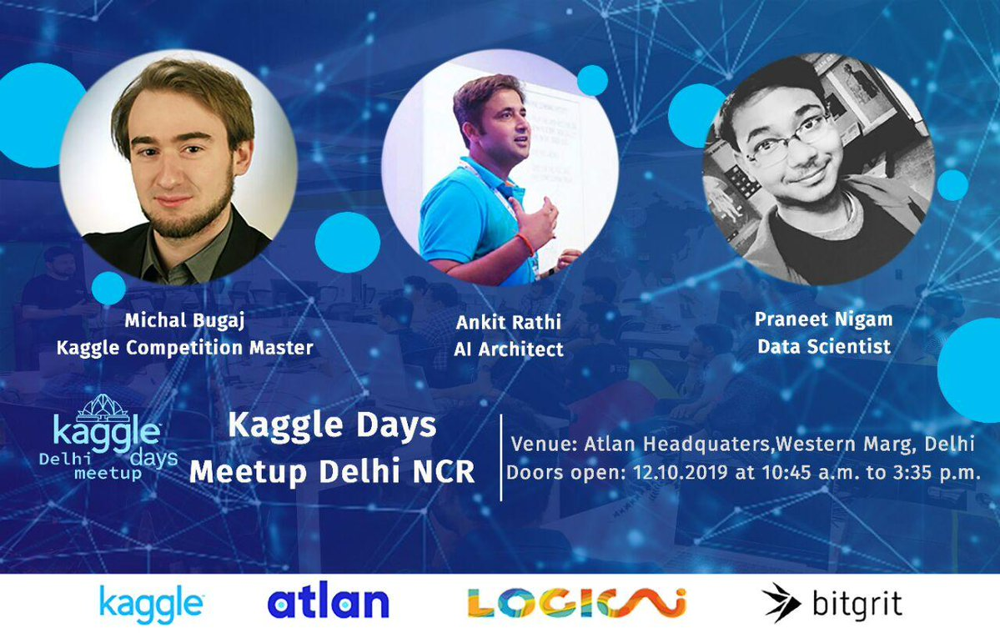

# A Hands on Session on Computer Vision
This repository contains the code explained during the talk, as well as the slides presented.

## How to get started?
- <b>Fork</b> the repo on Github
- <b>Clone</b> the project to your local machine
- <b>Install</b> the necessary packages by running `pip install -r requirements.txt`
- <b>Good to go</b>

## Pre-requisite
- A bit of experience with Python.
- Knowledge of Python scientific libraries (numpy, matplotlib).
- Experience with basic image processing and computer vision (have used OpenCV for example).
- Machine Learning experience helpful but not necessary

## Want to learn more
- [Get Started with Data Visualization](https://github.com/Praneet460/DataVisualizationPyDelhi)
- [Get Started with TensorFlow](https://github.com/Praneet460/MLCC)
- [Download OpenAcademy Android Application and start learning from free resources](https://play.google.com/store/apps/details?id=in.paperwrk.openacademyapp&hl=en)
- [Free OpenCV Book](./OpenCV_Book/opencv-python-tutroals-book.pdf)

## Issues
Feel free to submit issues and enhancement requests.

